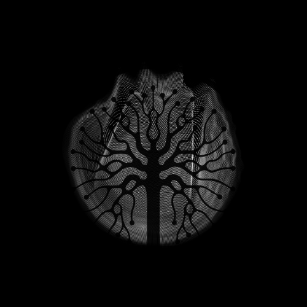

# # 🎧 MoodMixr
<p align="center">
  
</p>

**MoodMixr** is an AI-powered DJ Insight Tool that helps music producers and DJs:
- Analyze BPM, key, mood, and waveform
- Optimize DJ set order using energy curves
- Visualize waveform and EQ animations
- Use AI to tag music and generate transitions

Built with:
- `Streamlit` for UI
- `librosa` for audio processing
- `Cohere` for mood classification
- `Plotly` for interactive charts


## 🛠 Setup
1. Clone the repo  
2. Create `.env` using `.env.example`  
3. Run:
```bash
cd app
streamlit run moodmixr_app.py
